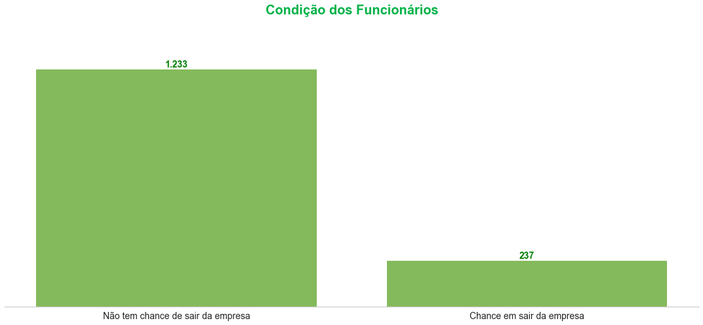
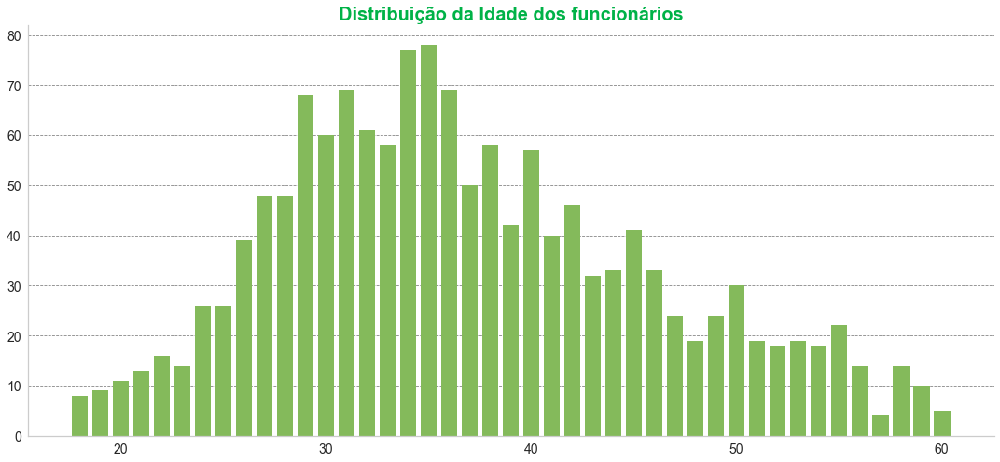
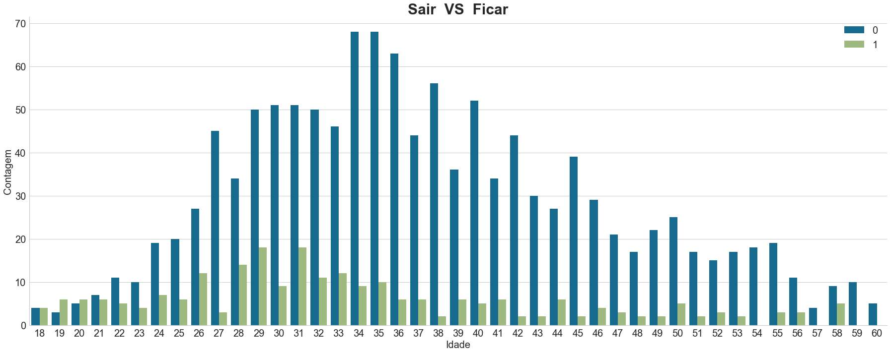
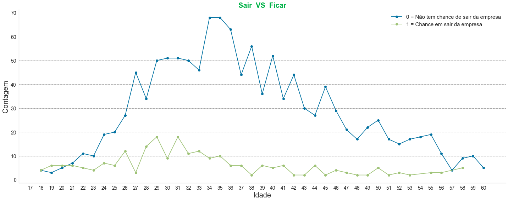
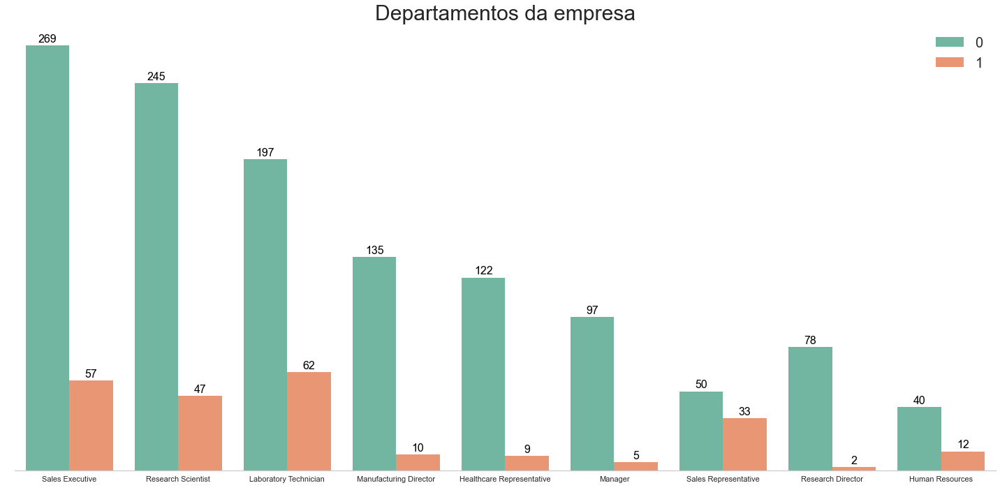
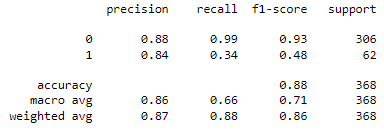
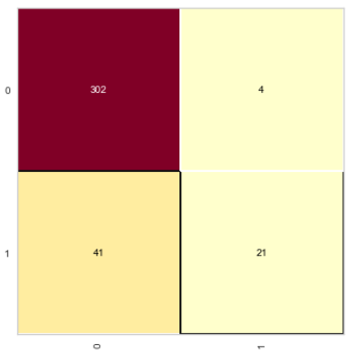
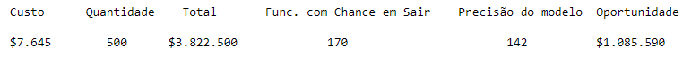

# Funcionários com propensão de sair do emprego
Este repositório contém script para previsão de quais funcionários com tendências de sair do emprego

 

# _Objetivo do projeto_

Fazer uma previsão de quais funcionários são mais propensos para sair do emprego.

 

# _1. Problema de Negócio_

Contratar e reter funcionários são tarefas extremamente complexas que exigem capital, tempo e habilidades.

A contratação de um novo funcionário custa em média $7645 (em uma empresa com aproximadamente 500 funcionários) e demora mais ou menos 52 dias para um funcionário ocupar de fato sua nova posição.

Foi entendido que o problema apresentado pelo time de negócios é a dificuldade em manter funcionários na empresa, para isso, foi solicitado um projeto para a previsão de funcionários com tendências de para sair do emprego.

Fonte: https://toggl.com/blog/cost-of-hiring-an-employee

Neste cenário fictício, nossa fonte de dados é um arquivo csv do Kaggle [clicando aqui](https://toggl.com/blog/cost-of-hiring-an-employee).

 

# _2. Justificativa_

- **Por quê:** Dificuldade em manter as pessoas talentosas na empresa.
- **Como:** Com a método CRISP-DM.
- **O quê:** Um modelo Machine Learning para classificar quais funcionários tem uma tendência de para sair do emprego.

 

# _3. Premissas_

As variáveis originais do conjuto de dados são: 

Variável | Definição
------------ | -------------
Age | idade das pessoas|
Attrition | variável resposta|
BusinessTravel | indica se a pessoa faz viajem na empresa|
DailyRate | cálculo do sálario da pessoa|
Department | departamento onde a pessoa trabalha|
DistanceFromHome | distância da casa para empresa em Km|
Education | indica o grau de escolaridade|
EducationField | indica a área da pessoa de atuação na empresa|
EmployeeCount | é como se fosse a contagem dos funcionários|
EmployeeNumber | número dos funcionários, como se fosse o registro do funcionário|
EnvironmentSatisfaction | nível de satisfação do funcionário com o ambiente de trabalho|
Gender | gênero|
HourlyRate | indica o número de horas trabalhadas|
JobInvolvement | envolvimento no trabalho|
JobLevel | nível de trabalho|
JobRole | nome das profisões|
JobSatisfaction | satisfação no trabalho|
MaritalStatus | estado civil|
MonthlyIncome | renda mensal|
MonthlyRate | taxa mensal|
NumCompaniesWorked | número de empresas que o fúnionario trabalhou|
Over18 | indica se o funcionário tem mais de 18 anos|
OverTime | indica se o funcionário faz horas extras|
PercentSalaryHike | indica o percentual de aumento que o funcionário ganhou|
PerformanceRating |avaliação de desempenho do funcionário|
RelationshipSatisfaction | indica o nível de satisfação|
StandardHours | quantas horas o funcionário trabalha|
StockOptionLevel | indica se a empresa tem ações na bolsa de valores|
TotalWorkingYears | indica quanto tempo o funcionário está trabalhando na empresa|
TrainingTimesLastYear | tempo em treinamento|
WorkLifeBalance | equilíbrio entre vida profissional|
YearsAtCompany | quantos anos o fucionário trabalhou na empresa|
YearsInCurrentRole | quantos anos de atuação na função atual|
YearsSinceLastPromotion | anos desde a última promoção|
YearsWithCurrManage | quantos anos está trabalhando como gerente|

 

# _4. Planejamento da Solução_

1. Entendimento do negócio:
 - Foi realizado a descrição do negócio.
2. Coleta dos dados:
 - Foi feito o downloand do arquivo da plataforma do Kangle.
3. Limpeza dos dados:
 - Foi realizado a Análise Descritiva dos Dados, passo importante para verificar o quanto, o projeto é desafiador, ou seja verificar a qualidade dos dados e o entendimento dos dados.
4. Análise exploratória dos dados:
 - Nesta etapa foi realizado a Exploração de Dados, que serve para medir o impacto das variáveis em relação as variáveis respostas e muitas vezes quantificar este impacto, nesta etapa começa gerar valor para o entendimento do negócio.
5. Preparação dos dados:
 - Agora entramos na Modelagem dos dados, onde vamos preparar os dados para ensinar os Algoritmo de Machine learning, passo importante, porque o aprendizado da maioria dos algoritmos de ML é facilitado com dados numéricos e na mesma escala.
6. Treinamento algoritmos de machine learning:
  - Nesta etapa vamos implementar os Algoritmos de Machine Learning, e escolher o que tem mais performance e seguir com ele para a produção.
7. Avaliação do algoritmo:
     - Nesta etapa é a oportunidade de responder: Qual seria o impacto deste resultado no negócio?
     - Dependendo da resposta podemos colocar em produção e deixar o time de negócio usar ou voltar e melhorar alguns pontos.
8. Implementar o modelo para produção:
   - É a etapa em colocar em produção ou fazer uma simulação do modelo, para deixar acessível para qualquer consumidor.

 

# _5. Insights_

*Resumo dos insights durante análise exploratória de dados (EDA):*

**Gráfico para saber a condição dos funcionários na empresa.**

 

**Nota:**
- Temos uma proporção de 20% de funcionários com chance em sair da empresa.

**Gráfico para saber a distribuição da idade dos funcionários na empresa.**

 

**Nota:**
- Quase 80 funcionários possuem 35 anos.

**Gráfico para saber a relação da idade com a chance de sair da empresa.**

 

 

**Nota:**
- Pessoas com 38 anos a maioria ficam na empresa e uma pequena parcela das pessoas sai.
- Pessoas com 54,57,59 e 60 anos, todas ficam na empresa.
- Podemos observar que conforme a idade vai aumentando a tendência das pessoas é que fiquem na empresa.

**Gráfico para visualizar os departamentos da empresa.**

 

**Nota:**
- No departamento Sales Representative é onde as pessoas mais saem da empresa.

**Oportunidade:**
1. Quanto mais nova a pessoa, mais chance ela tem de procurar outro tipo de emprego.
2. Quanto maior a distância entre o trabalho e a casa do funcionário, maior é a chance dele sair da empresa.
3. As pessoas que tem um grau de escolaridade menor tem mais chance de sairem da empresa, então a empresa pode oferecer um desconto em mensalidade de faculdades.

 

# _6. Modelos de Machine Learning_

1. Regressão logística.
2. Random forest.
3. Redes neurais.

 

# _7. Performance do Modelo de Machine Learning_

Como objetivo deste estudo de caso é **fazer uma previsão de quais funcionários são mais propensos para sair do emprego**, o modelo usando Regressão Logística tem um melhor desempenho, porque o algoritmo consegue ter uma precisão de 84% e com f1-score de 71%, que pode ajudar a diminuir o esforço do RH para encontrar estes funcionários com tendências de sair da empresa e continuar colhendo informações para melhorar o recall do algoritmo.

 

- Classe 0 = Não tem chance de sair da empresa
- Classe 1 = Chance em sair da empresa

Quando temos dados desbalanceado é interessante nós utilizarmos f1-score junto com macro avg, onde temos um valor de 0.71, que não é um resultado muito bom.

Na classe 0, o algoritmo consegue identificar corretamente 99% dos dos funcionários que não tem chance de sair da empresa e quando ele identifica, tem uma presisão de 88%.

Na classe 1, o algoritmo consegue identificar corretamente 34% dos funcionários que tem chance em sair da empresa e quando ele identifica, tem uma presisão de 84%.

Matriz de confusão

 

- Na classe 0 (Não tem chance de sair da empresa):
  - O algoritmo classificou corretamente 302 funcionários que não vão sair da empresa e 4 funcionários algoritmo errou porque de fato eles vão sair da empresa.

- Na classe 1 (Chance em sair da empresa):
  - O algoritmo classificou de forma erradamente 41 funcionários que não vão sair da empresa e 21 funcionários algoritmo acertou porque de fato eles vão sair da empresa.

Aplicando o modelo podemos identificar sobre os 500 funcionários, 142 colaboradores com chance em sair da empresa, surgindo uma oportunidade para o RH em reduzir um desperdício de contratação de $1.085.590.

 

# _8. Conclusão_

E o resultado desta solução, caso fosse implementada e aplicando o modelo podemos identificar sobre os 500 funcionários, 142 colaboradores com chance em sair da empresa, surgindo uma oportunidade para o RH em reduzir um desperdício de contratação de $1.085.590.

 

 

 

# _9. Próximos passos_

Fazer um balanceamento de dados, porque consequência desse desequilíbrio é que o modelo terá uma tendência a dar muitos “alarmes falsos“, ou seja, na prática ele irá responder muito bem entradas para as classes majoritárias, mas terá um desempenho inferior para as minoritárias e saber como lidar com dados desbalanceados pode fazer toda a diferença no projeto de Data Science e no desempenho do seu modelo de Machine Learning.
